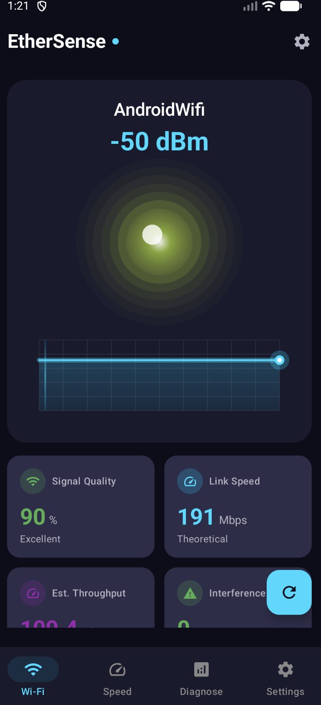
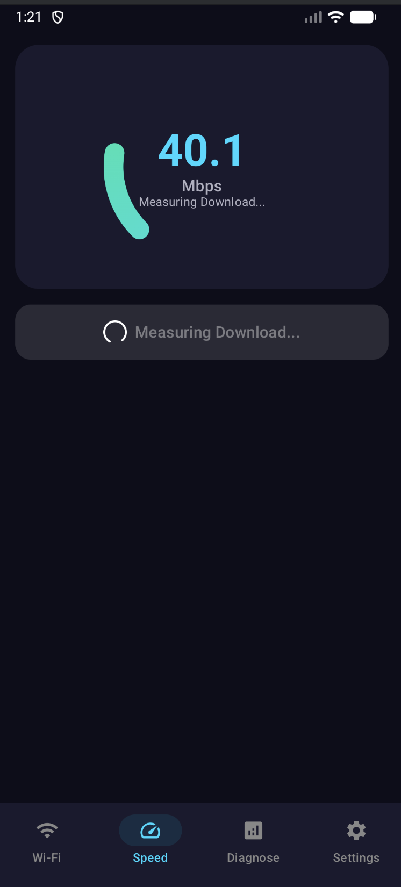
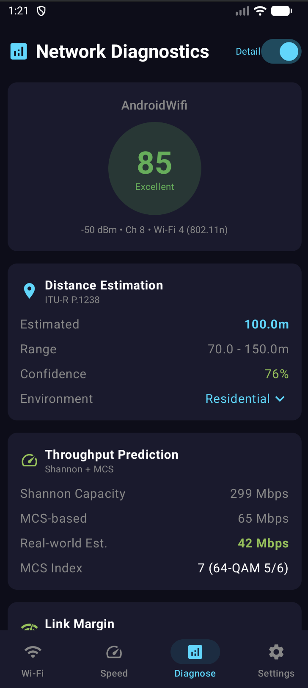
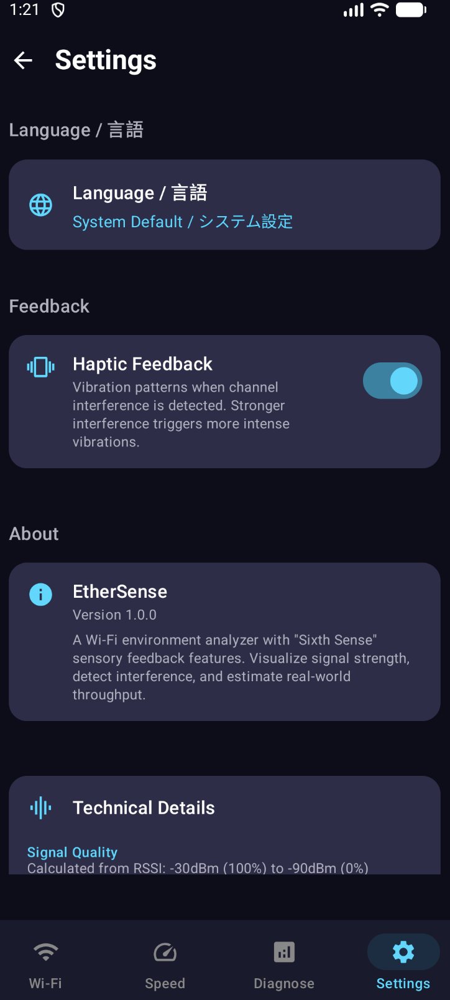

# EtherSense

Wi-Fi Network Diagnostics App

<p align="center">
  
</p>

## Features

### Real-time Signal Monitoring
Displays signal strength (RSSI), link speed, estimated throughput, and channel interference for your connected Wi-Fi in real-time.

### Speed Test
Measures download/upload speeds and latency. Also evaluates suitability for video streaming, online gaming, and video calls.

### Network Diagnostics

#### Distance Estimation (ITU-R P.1238)
Estimates the distance to your router from RSSI using the ITU indoor radio propagation model. Applies path loss coefficients based on environment type (residential, office, commercial).

#### Throughput Prediction (Shannon-Hartley)
Predicts theoretical maximum channel capacity using the Shannon-Hartley theorem and real-world throughput based on IEEE 802.11 MCS tables.

#### Link Margin Analysis
Calculates link margin from the difference between receiver sensitivity and RSSI to evaluate connection stability (Excellent >20dB / Good >12dB / Marginal >6dB / Unstable).

#### Signal Trend Prediction
Uses moving averages and linear regression on historical RSSI data to predict near-future signal quality.

### Network Tools

#### Ping
Test network connectivity with configurable packet count. Displays RTT statistics including min, average, max, and jitter.

#### DNS Lookup
Query DNS records for domains. Supports A, AAAA, CNAME, MX, NS, TXT, and other record types.

#### Whois
Retrieve domain registration information including registrar, creation date, and expiration.

#### Wake on LAN
Send magic packets to remotely wake devices on your local network.

#### Port Scanner
Scan target hosts to check which ports are open or closed.

#### LAN Scanner
Discover devices connected to your local network, showing IP address, hostname, and MAC address.

#### Service Discovery
Find services on your network using mDNS/Bonjour and UPnP/SSDP protocols.

#### Network Info
View current network configuration including IP address, gateway, subnet mask, and DNS servers.

## Download

Download the APK from [GitHub Releases](https://github.com/zabio3/EtherSense/releases).

## Screenshots

| Speed Test | Diagnostics | Settings |
|:---:|:---:|:---:|
|  |  |  |

## Privacy

- All processing runs locally on the device
- No data is sent to servers

## Build

```bash
./gradlew assembleDebug
```

Requires Android 8.0 (API 26) or higher.
